# <picture></picture> cloudpin

[](https://github.com/paureis/cloudpin/actions/workflows/ci.yml)
[](https://www.npmjs.com/package/cloudpin)
[](package.json)
[](LICENSE)

Pin cloud accounts to a project, and stop any command (yours or your AI agent's) that would run on the wrong one.

`az`, `aws`, `gcloud`, `vercel` and `gh` act on whichever account you logged into last. With a work account, a
personal one and a client or two on the same machine, sooner or later something gets deployed to, or deleted
from, the wrong place. Coding agents make it more likely: they run these commands for you and never stop to ask
which account is active. cloudpin checks before the command runs.

<p align="center"></p>

## Install

```sh
pnpm add --global cloudpin
```

<details>
<summary>npm, Yarn, Bun, or no install</summary>

```sh
npm install --global cloudpin
yarn global add cloudpin
bun add --global cloudpin

# try it without installing
npx cloudpin --help
```

</details>

Requires Node.js 22 or later. Works on Windows, macOS and Linux. cloudpin is in public beta (0.x): it works and
is tested, and feedback before 1.0 is very welcome.

## Quick start

```sh
cd your-project
cloudpin init                        # pin the accounts you are logged into now
cloudpin install-hook claude         # protect your AI agent (or codex, cursor, gemini, copilot)
echo 'eval "$(cloudpin shell-init bash)"' >> ~/.bashrc   # protect your terminal
```

Commit `.cloudpin.yml` so everyone on the project gets the same protection.

## Usage

```sh
# Write .cloudpin.yml from the accounts you are logged into now
cloudpin init

# ...or add them as one environment of the file (see Environments)
cloudpin init --env production --protected

# Show the environments, or choose the one to use in this clone
cloudpin use [<env> | --clear]

# Check every pinned account; exit 1 on a mismatch (handy in CI and scripts)
cloudpin check

# See each CLI's active account, what this folder pins, and which agent hooks are installed (--json for tools)
cloudpin status

# Run one command only if it would act on the pinned account; exit 3 if blocked
cloudpin exec -- vercel deploy --prod

# Shell functions that route az, aws, gcloud, vercel, gh, kubectl and helm through cloudpin
cloudpin shell-init bash|zsh|pwsh

# Add or remove the hook in an agent's settings (this project, or yours with --user)
cloudpin install-hook <agent> [--user]
cloudpin uninstall-hook <agent> [--user]
```

## How it works

A `.cloudpin.yml` in your project lists the accounts it uses. `cloudpin init` writes it for you, with readable
names as comments:

```yaml
azure:
  subscription: "3f2a0000-0000-0000-0000-000000000c91" # Acme Prod
  tenant: "8b1d0000-0000-0000-0000-00000000044e"
aws:
  account: "123456789012"
gcloud:
  account: "deploy@acme.com"
  project: "acme-prod"
vercel:
  team: "team_x9KqZr" # acme
github:
  user: "acme-bot"
kubernetes:
  server: "https://acme-prod.hcp.westeurope.azmk8s.io:443" # acme-prod-admin
  namespace: "payments"
```

Before a guarded command runs, cloudpin works out which account **that command** would use (asking the CLI, or for
Kubernetes reading the kubeconfig), honouring the command's own flags and environment, and compares the answer with
the file:

| CLI | What is pinned | What cloudpin takes into account |
|---|---|---|
| `az` | subscription ID, tenant ID | `--subscription`, `AZURE_CONFIG_DIR` |
| `aws` | account ID | `--profile`, `AWS_PROFILE`, access key variables, SSO |
| `gcloud` | account, project | `--account`, `--project`, `--configuration`, `CLOUDSDK_*` |
| `vercel` / `vc` | team ID | `--scope`, `--team`, `--token`, `VERCEL_TOKEN`, `VERCEL_ORG_ID`, linked project |
| `gh` | user, host | `--hostname`, `GH_HOST`, `GH_TOKEN`, `GITHUB_TOKEN` |
| `kubectl`, `helm` | API server URL, namespace (optional) | `--kubeconfig`, `KUBECONFIG`, `--context`, `--cluster`, `--server`, `-n`, `-A`, kuberc; helm's `--kube-context`, `--kube-apiserver`, `HELM_*` |

For Kubernetes the server URL is pinned rather than the context name, because context names are personal: the same
cluster is `prod` on one laptop and `acme-prod-admin` on another. `init` writes your context name as a comment, and
pins the namespace only if your context sets one. With a namespace pinned, `-A` / `--all-namespaces` is a mismatch.
Commands that never reach a cluster (`kubectl config`, `kubectl kustomize`, `helm template`, `helm repo`, ...) are
never blocked, and standalone `kustomize` isn't guarded at all. cloudpin can't see a `namespace:` written inside a
manifest you apply, so pin the namespace and keep manifests namespace-free if that matters to you.

- **Match:** the command runs as if cloudpin wasn't there.
- **Mismatch:** the command is stopped, and you're told which account is active and how to switch.
- **Can't tell** (an expired login, a broken token, no network): the command is stopped too, and cloudpin says so
  plainly, with the CLI's own reason and the command that shows what's wrong.

Logging in, logging out, switching accounts, `--help` and `--version` are never blocked. A folder without a
`.cloudpin.yml` is never affected. Monorepos work: the nearest `.cloudpin.yml` above the current folder wins.

## Environments

One file can pin staging and production separately. Mark an environment `protected` and, even on the right
account, any command that could change something asks first:

```yaml
environments:
  staging:
    vercel: { team: "team_staging" }
    aws: { account: "111111111111" }
  production:
    protected: true
    vercel: { team: "team_prod" }
    aws: { account: "222222222222" }
branches:          # optional: which environment a git branch uses
  main: production
  "release/*": production
  "*": staging
read_only:         # optional: more commands that never need confirmation
  azure: ["webapp log tail"]
```

**Which environment applies**, first match wins:

1. `CLOUDPIN_ENV=<name>` in the environment.
2. `cloudpin use <name>`: remembered for this clone, inside `.git`, so it is never committed.
3. The `branches` mapping for the checked-out branch: an exact name first, then the first matching pattern.
4. The first environment listed.

An unknown name is an error, so the command is stopped rather than checked against the wrong pins. `cloudpin
status` and every message say which environment applies and why.

**On a protected environment**, read-only commands run as usual. Everything else asks:

- In a terminal: `Continue? [y/N]`.
- Without a terminal (CI, scripts): the command stops unless `CLOUDPIN_CONFIRM=<name>` is set.
- Claude Code, Copilot CLI and Cursor ask you through the agent's own prompt. Codex and Gemini CLI have no working
  "ask" in their hooks, so the command is blocked and the agent is told to hand it to you.

The built-in read-only list is short on purpose (`az ... list|show`, `aws <service> describe-*|list-*|get-*` and
`s3 ls`, `gcloud ... list|describe`, `vercel ls|inspect|logs` and `<group> ls`, `gh <group> list|view|status`,
`kubectl get|describe|logs|top|explain`, `helm list|status|history|get`), so
anything it doesn't know asks. `read_only` can add commands, matched by their leading words, but never remove
any. A wrong account is still blocked outright, protected or not.

**Upgrading from the flat format:** nothing to do; a file without `environments` keeps working exactly as before.
To split it, move the provider sections under `environments:` and a name, or start a fresh file with
`cloudpin init --env <name>` and run it again per environment (after switching accounts).

## Protect your terminal

Add one line to your shell profile. Removing it uninstalls.

```sh
eval "$(cloudpin shell-init bash)"                          # ~/.bashrc
eval "$(cloudpin shell-init zsh)"                           # ~/.zshrc
```

```powershell
cloudpin shell-init pwsh | Out-String | Invoke-Expression   # $PROFILE
```

If cloudpin is ever uninstalled, the functions fall back to the real CLI, so they never get in your way. To run one
command anyway, on purpose: `CLOUDPIN_SKIP=1 <command>`.

## Protect your AI agent

```sh
cloudpin install-hook claude
```

The hook goes into the project's agent settings (`--user` for your personal settings). cloudpin shows the file before
writing it, keeps a backup, and `uninstall-hook` removes only its own entry. When a command is blocked, the agent is
told why and asked to check with you. Agents can't use `CLOUDPIN_SKIP` or `CLOUDPIN_CONFIRM`, can't pick an
environment by setting `CLOUDPIN_ENV` in their own command, and need your OK to run `cloudpin use`.

| Agent | Settings file | Status |
|---|---|---|
| Claude Code | `.claude/settings.json` | Tested inside the agent |
| Codex | `.codex/hooks.json` | Tested inside the agent |
| Cursor | `.cursor/hooks.json` | Built to the documented hook format |
| Gemini CLI | `.gemini/settings.json` | Built to the documented hook format |
| GitHub Copilot CLI | `.github/hooks/cloudpin.json` | Built to the documented hook format |

cloudpin reads the whole command line the agent is about to run, so it also catches
`cd ../other && npx vercel deploy`, `bash -c "..."`, pipelines, `$( )`, `xargs` and `find -exec`.

## Configuration

| Variable | Effect |
|---|---|
| `CLOUDPIN_SKIP=1` | Run one command without the check (terminal only; ignored for agents) |
| `CLOUDPIN_ENV=<name>` | Use this environment (see Environments) |
| `CLOUDPIN_CONFIRM=<name>` | Confirm changing commands on this protected environment without a prompt (terminal and CI only; ignored for agents) |
| `CLOUDPIN_NO_CACHE=1` | Always ask the CLI instead of using the identity cache |
| `CLOUDPIN_CACHE_DIR` | Where the identity cache lives |

Asking a CLI who it is takes 0.5 to 2 seconds, so cloudpin remembers a successful answer for up to five minutes.
The cache is dropped the moment anything that decides the account changes: the command's flags, the relevant
environment variables, or the CLI's own account files (which `az account set`, `gh auth switch` and
`vercel switch` rewrite). `cloudpin check` always asks the CLI.

| Exit code | Meaning |
|---|---|
| `0` | OK |
| `1` | Usage error, or `check` found a problem |
| `3` | Command blocked, or not confirmed on a protected environment |

## Security and privacy

cloudpin only reads which account is active, using each CLI's own identity command (`az account show`,
`aws sts get-caller-identity`, `gcloud config list`, `vercel teams ls`, `gh api user`). It never logs in or
switches accounts, never reads credential files, and never prints or stores a token: error messages name a variable
such as `GH_TOKEN` but never its value, and the cache stores salted hashes of anything sensitive. It runs CLIs
directly, never through a shell. cloudpin has no telemetry and sends nothing of its own; the identity commands
above talk only to their own provider, as they would if you ran them. See [SECURITY.md](SECURITY.md) to report a
problem.

<details>
<summary>FAQ</summary>

**Does it slow my commands down?** Outside a pinned project, by the time it takes Node to start (about 0.1 s).
Inside one, the first check costs one identity call, and later checks come from the cache.

**What if a CLI isn't installed?** A pinned CLI that isn't installed is skipped; the command would fail on its own.

**Can I use it in CI?** Yes. Run `cloudpin check` before deploying; it exits 1 if any pinned account doesn't match.

**Why block when it can't tell?** Because "probably the right account" is the situation cloudpin exists to prevent.
The message tells you exactly why it couldn't tell.

</details>

## Roadmap

Ideas and what's next are in [ROADMAP.md](ROADMAP.md). Suggestions are welcome in
[issues](https://github.com/paureis/cloudpin/issues).

## Development

<details>
<summary>Contributor commands</summary>

```sh
git clone https://github.com/paureis/cloudpin.git
cd cloudpin
npm ci
npm run build
npm test
```

| Command | Description |
|---|---|
| `npm run build` | Compile to `dist/` |
| `npm test` | Run the test suite |
| `npm run typecheck` | Type-check without emitting |
| `node scripts/smoke.mjs` | Check providers against the CLIs logged in on your machine (after a build) |
| `node scripts/demo.mjs` | Regenerate `assets/demo.svg` (after a build) |

The design decisions, and why they were made, are in [DESIGN.md](DESIGN.md). See [CONTRIBUTING.md](CONTRIBUTING.md)
before opening a pull request.

</details>

## About

Made by [Alvaro Reis](https://github.com/paureis) ([LinkedIn](https://www.linkedin.com/in/alpaureis)), with Claude
Code as a pair programmer. Every behaviour is covered by tests, and every CLI integration is checked against the
tool's own documentation and the real CLI.

[MIT](LICENSE)
